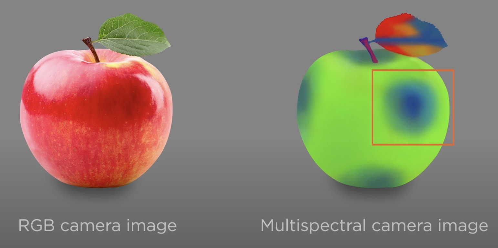
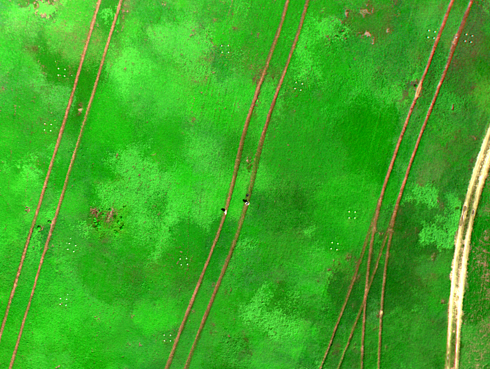
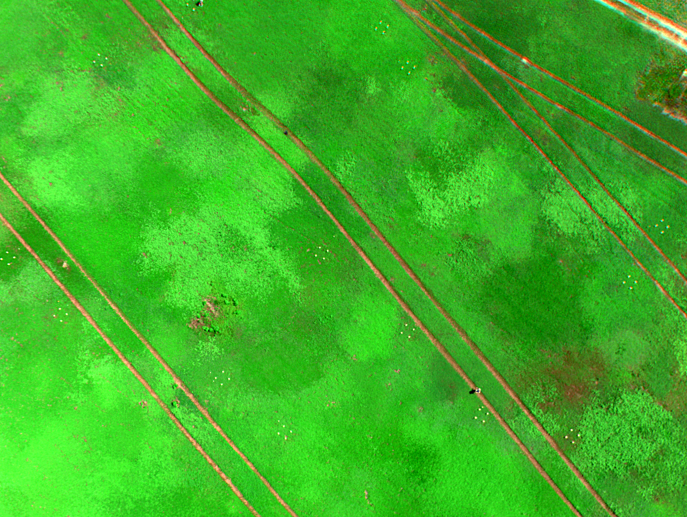
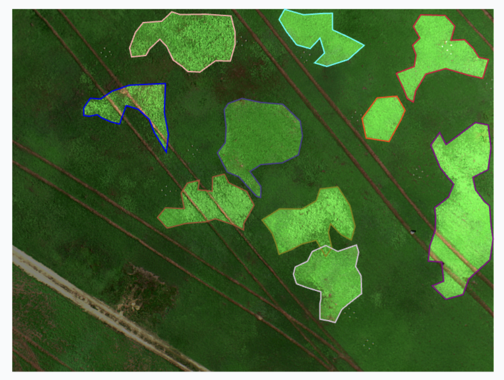
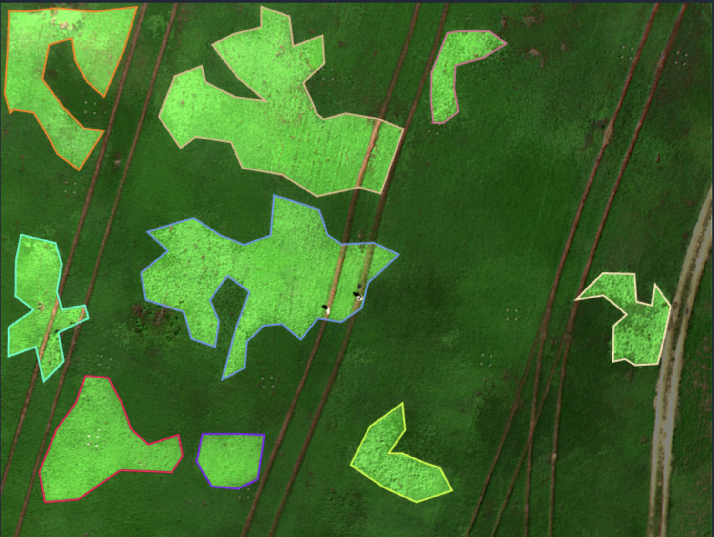
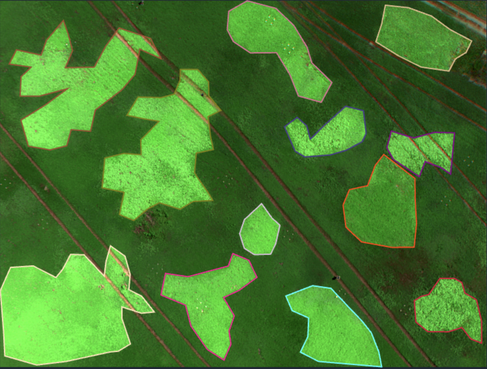
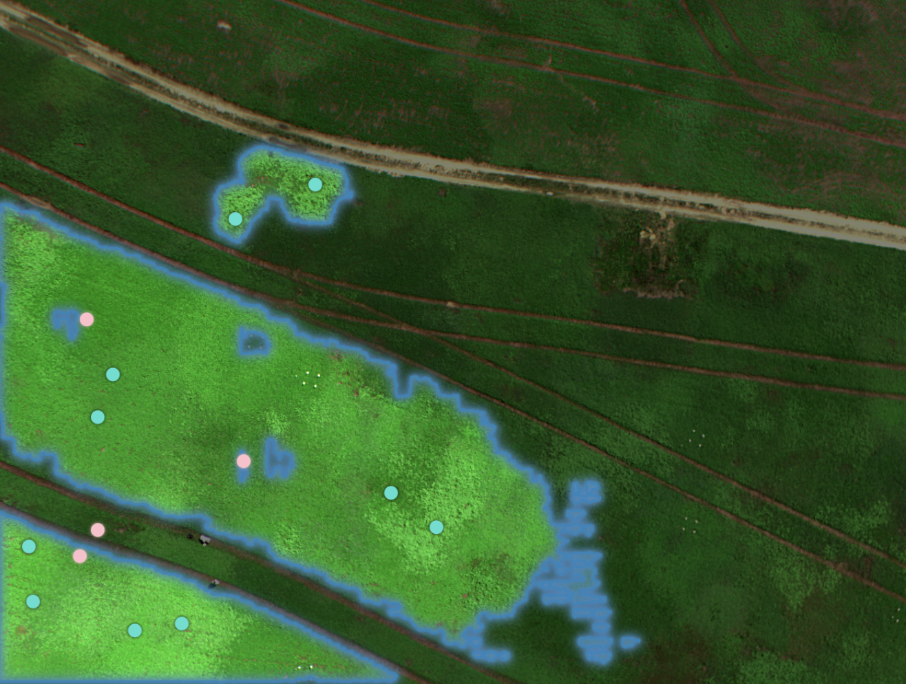

# Multispectral Image(MSI) Segmentation of Blueberry Genotypes

MSI captures unique reflectance patterns across wavelengths and has strong potential for early detection of crop stress and disease. Our goal is to segment blueberry genotypes from drone images captured by a MicaSense camera to support expert field analysis.

  

---

## 📌 Overview

- Tested several RGB-based models, including the Segment Anything Model(SAM) and a pretrained UNet that used three-channel pseudo-RGB composites derived from PCA.
- Annoted 50 Blueberry field RGB images.
- Overfitted YOLO11 Segmentation Model to see the feasibility.

---

## 🎬 Raw MSI

  
  
  
  
  

---

## 🎬 RGB after MicaSense Alignment

  
  
  

---

## 🎬 Annotation

  
  
  

---

## 🎬 Model Predictions

  
  
  

